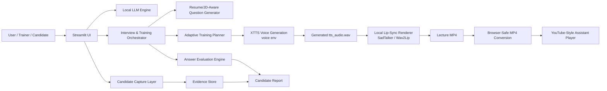
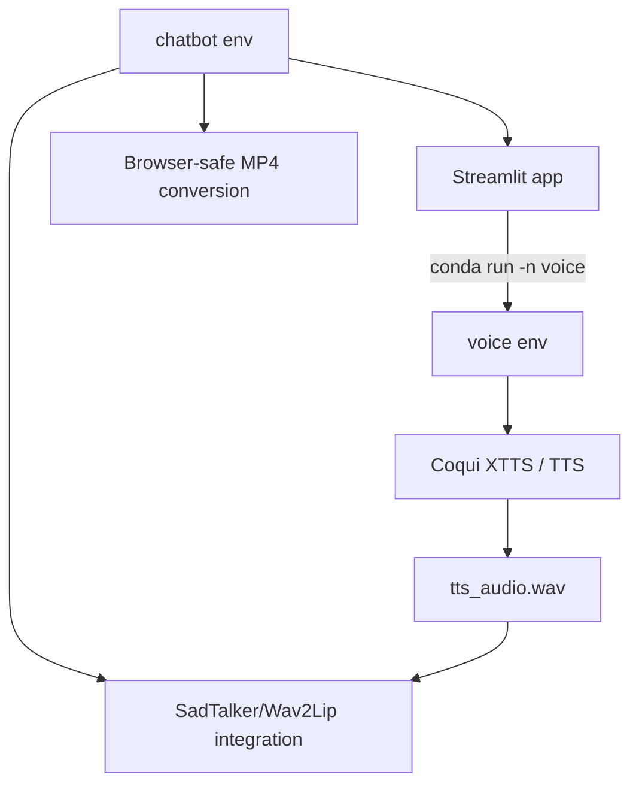

# Architecture & Product Design

ASHU Mentor AI Studio is organized as a local-first, multi-stage AI system. The core application runs in the `chatbot` environment, while the consent-based voice generation pipeline runs in a separate `voice` environment to avoid dependency conflicts with video rendering.

## High-Level Architecture

## Runtime Layers

| Layer | Responsibility |
|---|---|
| Streamlit UI | Tabs, controls, teaching assistant panel, progress bars, downloads |
| Local LLM | Question generation, evaluation feedback, adaptive training content |
| Interview Engine | Resume/JD-aware rounds, coding prompts, face-to-face questions |
| Voice Engine | Consent-based XTTS generation using selected authorized sample |
| Video Engine | SadTalker/Wav2Lip rendering, browser-safe MP4 conversion |
| Cache Layer | Reuse previous `tts_audio.wav` and generated MP4 for faster demos |
| Evidence Layer | Recording metadata, screenshots, logs, transcripts, downloadable bundles |

## Environment Separation

This separation prevents XTTS/TTS dependencies from breaking the video rendering stack.
