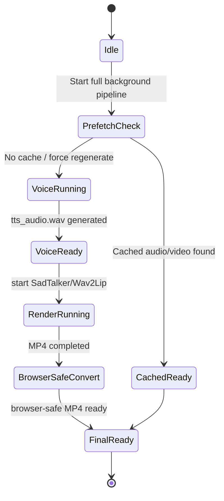

# Background Rendering & Cache Reuse

Voice generation and lip-sync rendering are slow because they are deep-learning workloads. ASHU Mentor AI Studio avoids freezing the UI by running long jobs in the background and by reusing previously generated media.

## Why Rendering Is Slow

| Step | Reason |
|---|---|
| XTTS voice generation | Voice cloning is model inference; CPU runs are slower |
| SadTalker video generation | Generates talking-head frames and merges audio/video |
| Browser-safe conversion | Re-encodes MP4 to H.264/AAC for Streamlit/Chrome playback |

## Background Pipeline



## User Controls

| Control | Purpose |
|---|---|
| Prefetch latest generated audio/video | Loads last generated media for current segment |
| Force regenerate instead of using cached output | Ignores cache and creates new audio/video |
| Start full background pipeline | Starts audio + video generation without freezing app |
| Refresh pipeline status | Updates progress and detects completed outputs |

## Cache Files

Each generated segment creates a folder like:

```text
lipsync_renders/training_segment_1_REST_API_security_and_JWT_authentication_<timestamp>/
```

Common files:

```text
tts_audio.wav
tts_audio.script.txt
manifest.json
voice_generation_run.log
renderer_run.log
talking_presenter_output.mp4
talking_presenter_output_browser.mp4
```

## Recommended Demo Workflow

1. Generate once using full background pipeline.
2. Use `Prefetch latest generated audio/video` for later demos.
3. Tick `Force regenerate` only when script, presenter, or voice sample changes.
