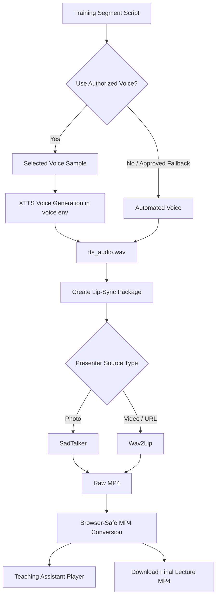

# Digital Presenter, Voice & Lip-Sync Pipeline

This page describes how ASHU Mentor AI Studio converts a training script into a digital-human lecture video.

## Pipeline Overview



## Voice Generation Modes

| Mode | Meaning |
|---|---|
| `authorized_voice_sample_xtts_if_available` | Uses selected consent-based voice sample through XTTS |
| `automated_voice_user_approved` | Uses automated voice only after user approval |
| `browser_speech_preview` | Fast browser demo voice, not a cloned/authorized XTTS voice |

## Why Browser Speech Is Different

The live browser demo uses `speechSynthesis` voices available in the browser/OS. It is useful for quick preview, but it cannot sound like the selected XTTS voice sample.

For the selected voice sample, the correct path is:

```text
voice sample → XTTS → tts_audio.wav → SadTalker/Wav2Lip → MP4
```

## Confirming Voice Usage

Check the latest render manifest:

```bash
latest_dir=$(find lipsync_renders -mindepth 1 -maxdepth 1 -type d -printf "%T@ %p\n" | sort -n | tail -1 | cut -d' ' -f2-)
cat "$latest_dir/manifest.json" | python -m json.tool | grep -E "authorized_voice_sample|voice_generation_mode|tts_audio"
cat "$latest_dir/voice_generation_run.log" | tail -80
```

A successful authorized voice run should show:

```text
Using model: xtts
authorized_voice_sample
voice_generation_mode: authorized_voice_sample_xtts_if_available
tts_audio.wav
```
