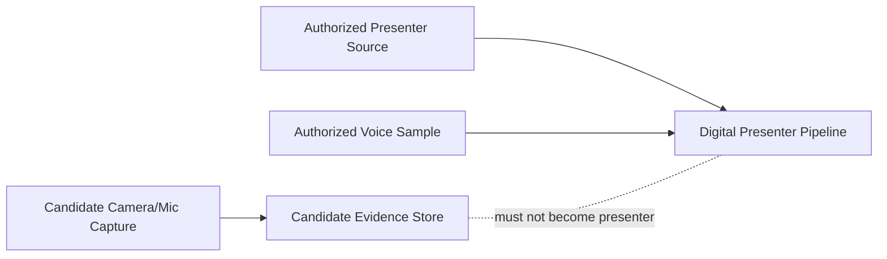

# Security, Consent & Governance

ASHU Mentor AI Studio is designed around explicit consent and local-first processing.

## Consent Rules

1. Voice cloning must use only an authorized voice sample.
2. Presenter photo/video must be consent-based.
3. The system must not silently fall back from authorized voice to automated voice.
4. If XTTS fails, the app must ask the user before using automated voice.
5. Candidate capture must stay separate from digital presenter generation.

## Safety Boundary

The candidate capture stream is for performance review, transcript support, focus-change events, screenshots, and audit evidence. It is not used to create the digital presenter.

## Local Processing

The application is intended to run locally in controlled environments. Sensitive files such as voice samples, candidate recordings, transcripts, and reports should remain on the user's machine unless explicitly exported.

## Recommended Data Handling

| Data | Handling Recommendation |
|---|---|
| Voice sample | Store locally, use only with consent, allow deletion |
| Presenter source | Store locally and label as authorized |
| Candidate recording | Store separately from presenter assets |
| Reports | Export only when user approves |
| Logs | Keep for debugging and reproducibility |

## Governance Checklist

- [ ] Voice sample is authorized
- [ ] Presenter source is authorized
- [ ] Coqui/XTTS model terms accepted
- [ ] Automated fallback approved by user if used
- [ ] Candidate capture disclosure shown
- [ ] Generated output is downloadable and auditable
