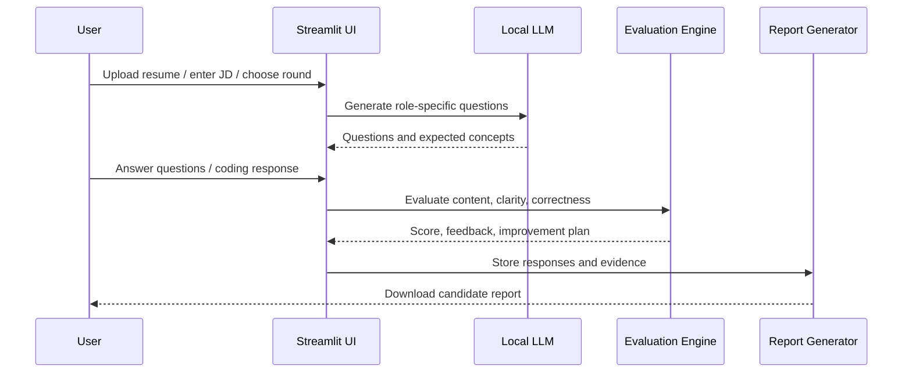

# Training & Interview Workflow

ASHU Mentor AI Studio supports both interview simulation and adaptive training.

## Interview Workflow



## Adaptive Training Workflow

1. Candidate profile and weak areas are identified.
2. The system creates targeted learning segments.
3. Each segment contains:
   - Concept explanation
   - Why interviewers ask this
   - Real project relevance
   - Visual explanation block
   - Checkpoint question
4. The training segment can be converted into:
   - Browser demo speech
   - XTTS generated audio
   - Digital-human rendered lecture video
   - Downloadable MP4

## Training Segment Structure

```text
Segment title
Concept clarity
Definition
Why interviewers ask this
Real project relevance
Visual explanation
Checkpoint question
Generated lecture audio/video
```

## Example Segment

**Topic:** REST API security and JWT authentication

The segment explains REST API security, JWT token structure, authentication/authorization flow, bearer-token usage, token expiry, refresh tokens, and real project security relevance.
