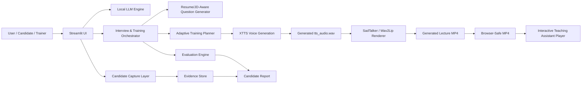
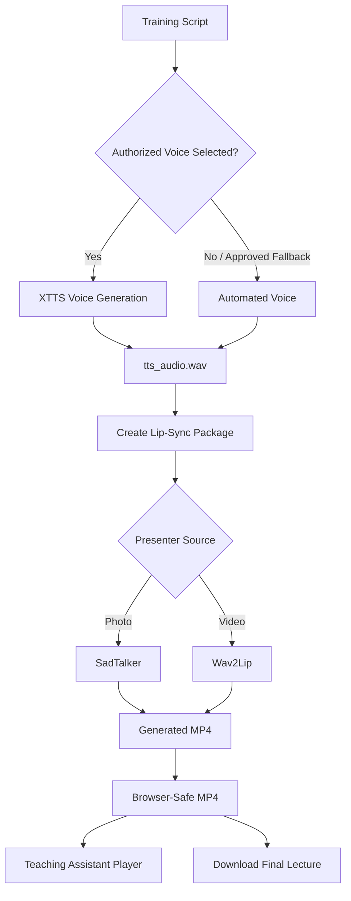

# ASHU Mentor AI Studio

**ASHU Mentor AI Studio** is a local-first AI interview, evaluation, and adaptive training platform that combines resume-aware questioning, job-description-aware interview simulation, candidate performance capture, adaptive training recommendations, consent-based voice generation, and digital-human lecture rendering.

**Full form:** Adaptive Smart Human-like Unit Mentor AI Studio  
**Tagline:** An end-to-end AI mentor for interviews, evaluation, adaptive learning, and digital-human training.

---

## Demo & Live App

<p align="center">
  <a href="https://youtu.be/2XXnTbtjREs">
    
  </a>
  <a href="https://huggingface.co/spaces/AnubhaParashar/ASHU">
    
  </a>
</p>

- **Video walkthrough:** [Watch ASHU Mentor AI Studio demo on YouTube](https://youtu.be/2XXnTbtjREs)
- **Live interactive app:** [Try ASHU Mentor AI Studio on Hugging Face Spaces](https://huggingface.co/spaces/AnubhaParashar/ASHU)

---

## Project Summary

ASHU Mentor AI Studio helps users conduct structured interview practice, evaluate candidate responses, generate personalized learning plans, and deliver training through a digital-human teaching assistant. The system supports resume/JD-based question generation, coding-round evaluation, face-to-face probing, candidate evidence capture, and AI-generated lecture videos using an authorized presenter and voice sample.

The platform is designed for local execution, controlled experimentation, interview coaching, candidate readiness assessment, and AI training demonstrations.


## Key Features

- Resume-aware interview question generation
- Job-description-aware interview simulation
- Candidate answer scoring and feedback
- Coding-round and technical-round support
- Adaptive training recommendations
- Digital-human teaching assistant preview
- Consent-based XTTS voice generation
- SadTalker/Wav2Lip-based lip-sync video generation
- Full background voice + video rendering pipeline
- Cached lecture prefetching to avoid repeated slow rendering
- Browser-safe MP4 conversion for embedded playback
- Interactive assistant video player with playback controls
- Downloadable final lecture video with generated audio
- Candidate evidence, transcript, and report export support
- Technical architecture diagrams inside the app

---

## System Architecture



---

## Runtime Environments

The project uses separate environments to avoid dependency conflicts.

| Environment | Purpose |
|---|---|
| `chatbot` | Main Streamlit app, UI, training workflow, SadTalker/Wav2Lip orchestration |
| `voice` | XTTS/Coqui voice generation only |

---

## Important Local Paths

| Component | Path |
|---|---|
| Main app | `/mnt/c/Users/AnubhaAnubha/OneDrive - Pearce Services, LLC/onedrive_ubuntu/project/chatbot3` |
| SadTalker renderer | `/home/anubhaparashar/ashu_renderers/SadTalker` |
| Wav2Lip renderer | `/home/anubhaparashar/ashu_renderers/Wav2Lip` |
| Voice samples | `voice_samples/` |
| Generated renders | `lipsync_renders/` |
| Presenter sources | `presenter_sources/` |

---

## Local Run Command

Run the app from the `chatbot` environment:

```bash
conda activate chatbot

cd "/mnt/c/Users/AnubhaAnubha/OneDrive - Pearce Services, LLC/onedrive_ubuntu/project/chatbot3"

ASHU_VOICE_ENV=voice COQUI_TOS_AGREED=1 PYTHONNOUSERSITE=1 python -m streamlit run app.py --server.fileWatcherType none
```

---

## Voice Environment Validation

Run this in the `voice` environment:

```bash
conda activate voice

PYTHONNOUSERSITE=1 python -c "import numpy, scipy, torch; print('numpy', numpy.__version__); print('scipy', scipy.__version__); print('torch', torch.__version__)"

COQUI_TOS_AGREED=1 PYTHONNOUSERSITE=1 python -c "from TTS.api import TTS; TTS('tts_models/multilingual/multi-dataset/xtts_v2'); print('XTTS model load OK')"
```

Expected validated stack:

```text
numpy 1.22.0
scipy 1.11.4
torch 2.2.2+cpu
XTTS model load OK
```

---

## Digital Presenter Workflow



---

## Background Pipeline and Cache

The voice and video generation process can be slow because XTTS and SadTalker/Wav2Lip are deep-learning workloads. ASHU Mentor AI Studio supports background rendering and cached media reuse.

Recommended workflow:

1. Generate the lecture once using **Start full background pipeline: voice + video**.
2. Use **Prefetch latest generated audio/video** for later demos.
3. Use **Force regenerate** only when the script, presenter, or voice sample changes.

---

## Hugging Face Space Deployment

For Hugging Face deployment, keep the YAML configuration at the top of `README.md` and keep `requirements.txt` as a pure package list.

```yaml
---
title: ASHU Mentor AI Studio
emoji: 🎓
colorFrom: blue
colorTo: indigo
sdk: streamlit
sdk_version: "1.25.0"
app_file: app.py
pinned: false
---
```

---

## Repository Structure

```text
ASHU Mentor AI Studio
├── app.py
├── README.md
├── requirements.txt
├── packages.txt
├── .streamlit/
│   └── config.toml
├── tools/
│   ├── voice_clone_xtts.py
│   ├── setup_voice_env.sh
│   └── setup_lipsync_renderers.sh
├── renderers/
├── presenter_sources/
├── voice_samples/
├── lipsync_renders/
├── recordings/
├── report_exports/
└── sample_data/
```

---

## Safety and Consent Boundary

ASHU Mentor AI Studio is intended for authorized and consent-based use only.

- Voice cloning must use an authorized voice sample.
- Presenter image/video must be consent-based.
- Candidate capture is separate from digital presenter generation.
- The app does not silently fall back from authorized voice to automated voice.
- Automated fallback requires user approval when XTTS fails.

---

## GitHub Wiki

The project wiki includes pages for Home, Demo & Live App, Architecture & Product Design, Complete Technical Specification, Training & Interview Workflow, Digital Presenter Voice & Lip-Sync Pipeline, Background Rendering & Cache Reuse, Feature Reference, Acceptance Criteria Mapping, Evidence Pack & Reporting, Security, Consent & Governance, Quick Links, and About ASHU Mentor AI Studio.

---

## Maintainer

Maintained by **Dr. Anubha Parashar** / **@dranubhaparashar**.
